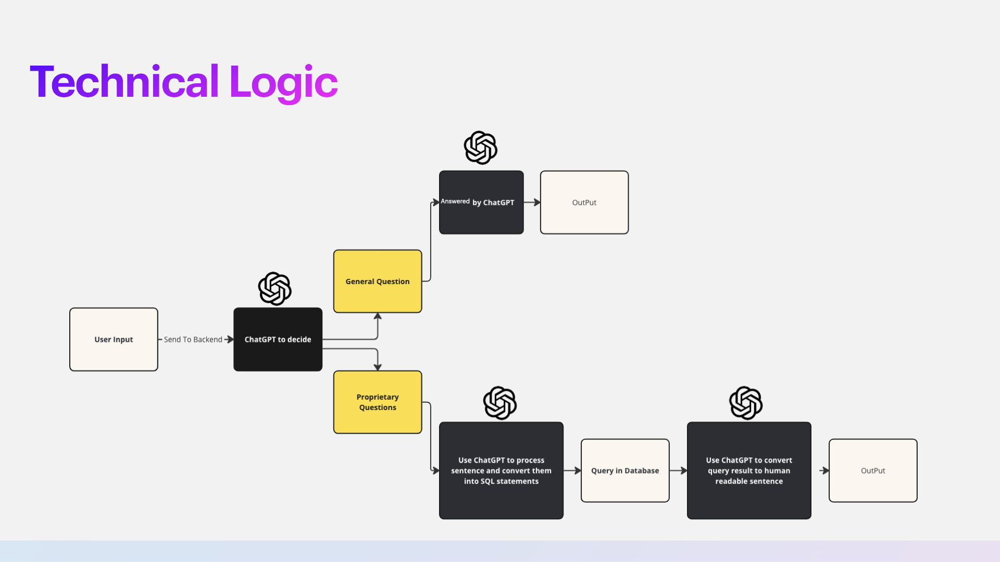
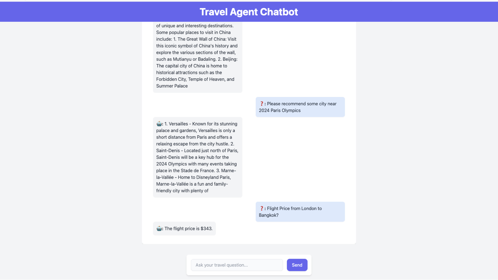

# Travel Chatbot with ChatGPT

### About the project

The Travel Chatbot project is built with the OpenAI API and a custom database. When a user inputs a query, it is first analyzed by ChatGPT to determine whether it is a general question or a proprietary question.

- General Questions: If the query is a general question, ChatGPT will generate a response directly and return it to the user as output.

- Proprietary Questions: If the query is identified as proprietary, ChatGPT will process the query to convert it into an SQL statement. This SQL query is then executed against the custom database to retrieve the relevant information. Once the data is retrieved, ChatGPT processes the results to convert them into a human-readable format before returning the final output to the user.

This system ensures that the chatbot can handle both common travel-related questions and specific queries that require access to a custom database, providing users with accurate and relevant information tailored to their needs.



---

### How to Run the Project:

1. **Setup**: Begin by adding your OpenAI API token and ensuring your database connection is properly configured.

2. **Start the Development Server**:

   ```bash
   npm run dev
   # or
   yarn dev
   # or
   pnpm dev
   # or
   bun dev
   ```

3. **View the Project**: Open your browser and navigate to [http://localhost:3000](http://localhost:3000) to see the application in action.


